<div align="center">

<br>


<br>


<br>

---

Building productivity software, Discord applications, and data-driven tools with a focus on creating software that's both practical and enjoyable to use.

Currently studying **Data Science** at the **University of Regina**.

</div>

---

## About

```bash
$ whoami

Name        : kexnyxie
Location    : Regina, Saskatchewan
Education   : B.Sc. Data Science
Focus       : Software Development • Automation • Data Science

Current Project
└── Gyeol Study Bot v2

Currently Learning
└── Machine Learning
└── Data Structures & Algorithms
└── Statistical Computing
```

---

## Featured Project

# 🚀 Gyeol Study Bot

An RPG-inspired productivity assistant for Discord that transforms studying into a rewarding experience through XP, Pomodoro sessions, streaks, quests, reminders, and analytics.

**Tech Stack**


> Repository coming soon.

---

## GitHub Activity

<div align="center">


<br>


</div>

---

## Projects

| Project | Description | Stack |
|----------|-------------|-------|
| **Gyeol Study Bot** | RPG-inspired productivity assistant for Discord. | Node.js · Discord.js |
| **Venus** | Community moderation and automation bot. | Python · Discord.py |
| **Desktop Calendar** | Lightweight desktop planner with a custom-designed interface. | Electron · Node.js |
| **Weather App** | Live weather dashboard powered by REST APIs. | JavaScript |
| **Number Guessing Game** | One of my earliest Python projects exploring game logic. | Python |

---

## Tech Stack

### Languages


### Frameworks & Tools


### Data Science


---

## Connect

<div align="center">

<a href="mailto:nyxd052007@gmail.com">

</a>

<a href="https://discord.com/users/ke.nx_">

</a>
<br><br>

*"Building useful software with a little personality."*

</div>
